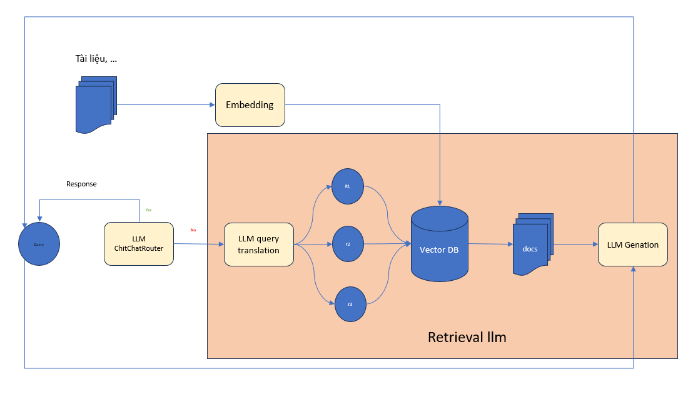

**Kiến trúc của tài liệu**



**Cách thực inference code**
Tạo file .env
```
# .env
GOOGLE_API_KEY = ""
ANTHROPIC_API_KEY = ""
DEEPSEEK_API_KEY = ""
RESOURCE_PROJECT_INVALID = ""
GROQ_API_KEY = ""
OPENAI_API_KEY = ""
MISTRAL_API_KEY = ""
```
**Thực hiện việc cài đặt qdrant trên local**
Truy cập trang https://qdrant.tech/documentation/quickstart/ làm theo hướng dẫn

**Chạy chương trình**
```
pip install -r requirements.txt
streamlit run streamlit_app.py
```

**Mô Tả Luồng**

1. Thêm tài liệu: Tài liệu được embedding và đưa vào vector store dưới dạng vector 768 chiều
2. Khi nhận query của người dùng hệ thống sẽ kiểm tra câu query thuộc dạng câu hỏi như thế nào. Nếu câu hỏi trò chuyện giao tiếp bình thường thị LLM sẽ trả lời trực tiếp.
3. Nếu câu hỏi là câu hỏi kiến thức thì hệ thống sẽ đưa câu hỏi vào module query translation để thực hiện việc viết lại câu hỏi truy vấn cho phù hợp để có thể tìm kiếm dữ liệu trong ở vector store.
4. Sau khi tìm kiếm được context phù hợp query và context sẽ được chuyển tới module LLM genation để thực hiện việc đưa ra câu trả lời cuối cùng cho người dùng.
